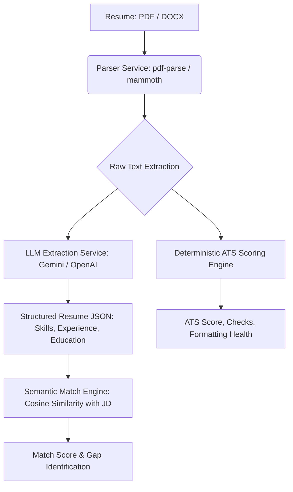
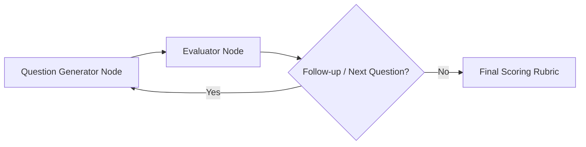
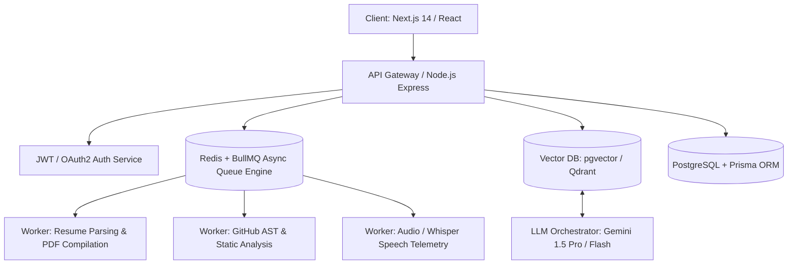

# AI Career Twin — Product Roadmap & Architecture

This document serves as the persistent product roadmap, technical design contract, and memory of the AI Career Twin product. Designed for a senior tech architecture context, it treats the project not as a simple toy/prototype, but as a production-grade SaaS product.

---

## 🛠️ Phase 1 — Resume + ATS Analyzer (Current Phase)
*Objective: Establish the document-parsing, deterministic rule-based analysis, and LLM structured extraction pipeline.*

### 1. Parsing & Extraction Pipeline

* **Resume Parser:** Handle DOCX (via `mammoth`) and PDF (via `pdf-parse`).
* **Structured Extraction:** Transform unstructured text into a clean JSON Schema (`skills`, `experience`, `education`) utilizing Gemini/OpenAI structured outputs.
* **Deterministic ATS Scoring:**
  * Strict rule-based checks (contact info, sections presence, quantified bullet points, word counts, formatting noise proxy).
  * Implemented in JavaScript for testability, consistency, and zero API call overhead.
* **Semantic Match Engine:** Calculate cosine similarity between the extracted resume skills/experience embeddings and the user-provided Job Description.

---

## 🎯 Phase 2 — Skill Gap + Roadmap Generator (Weeks 3-4)
*Objective: Build personalized skill roadmaps and gap-analysis engines using static datasets & LangGraph planners.*

* **Target Role Context:** Input target role and senior level.
* **Skill Ontology / RAG Retrieval:** Compare extracted resume skills vs. role requirements using a curated skills/roles dataset.
* **LangGraph Planner Agent:**
  * **State:** Remaining gaps, available hours/day, target completion date, current roadmap progress.
  * **Nodes:**
    * `Analyzer Node`: Identifies high-priority gaps.
    * `Planner Node`: Generates daily/weekly personalized study plans, recommended projects, or certifications.
    * `Reviewer Node`: Checks plan feasibility against available hours/day.

---

## 💻 Phase 3 — GitHub Analyzer (Weeks 5-6)
*Objective: Quantify development practices and engineering behaviors using heuristics and lightweight summaries.*

* **GitHub API Integration:** Fetch repository metadata, commit frequencies, programming languages, README presence, and test coverage indicators.
* **Heuristic Profiling:**
  * Code cleanliness, project structure, repository diversity.
  * Commit frequency & consistency (green-square density).
* **LLM Summarization:** Instead of executing expensive code reviews via LLM, use the LLM to generate high-level summaries of featured projects, identifying architecture patterns used.

---

## 🗣️ Phase 4 — Mock Interview Agent (Weeks 7-9)
*Objective: A multi-turn interactive conversational agent assessing technical, behavioral, and architectural skills.*

* **LangGraph Multi-Turn Architecture:**
  * `Question Generator Node`: Generates relevant questions based on target role, experience level, and resume.
  * `Evaluator Node`: Critiques candidate answers against an internal rubric.
  * `Follow-up / Pivot Node`: Determines whether to deep-dive on the current topic or move to the next domain.
* **Voice vs. Text Modality:** Support whisper transcription for voice-in and text-to-speech for voice-out to simulate realistic interviews.

---

## 📊 Phase 5 — LinkedIn Check & Unified Dashboard (Weeks 10+)
*Objective: Profile assessment and synthesis of all data streams into a single "Readiness Dashboard".*

* **LinkedIn Profile Integration:** Since official APIs are highly restricted, provide clean workflows for copy-pasting profile text or importing PDF profile exports.
* **Unified Readiness Dashboard:**
  * Combined readiness score aggregating ATS score, skill match, GitHub activity, mock interview performance, and LinkedIn optimization.
  * Live action list highlighting the fastest path to hiring readiness.

---

## 🚀 Phase 6 — Next-Gen Production Architecture & Market Dominance Upgrades (10+ Year Senior Architect Blueprint)

*Objective: Transform the AI Career Twin into an enterprise-grade, high-concurrency, market-dominating SaaS product with game-changing AI capabilities and B2B monetization.*

### 🏗️ 1. Enterprise System Architecture Foundation

* **High-Concurrency Async Queues:** Process long-running operations (PDF generation, AST parsing, audio telemetry) using **BullMQ** and **Redis** off the main thread.
* **Vector DB Engine:** Integration of **pgvector** / **Qdrant** for semantic matching between resumes, code embeddings, and real-time job market descriptions.

---

### ⚡ 2. Autonomous Resume Morpher Engine (Phase 1 Upgrade)
* **Zero-Hallucination Resume Morpher:** Automatically rephrases existing resume bullets to target specific Job Description (JD) keywords without fabricating experience.
* **On-The-Fly ATS PDF Compiler:** Uses headless Chrome (`Puppeteer`) or `typst` to dynamically render pixel-perfect, 100% ATS-parsed PDFs on demand.

---

### 📈 3. Live Market Telemetry & Dynamic Micro-Projects (Phase 2 Upgrade)
* **Real-Time Job Vector Engine:** Continuously ingests live JDs into Vector DB to show real-time skill demand trends (e.g., *"Next.js Server Actions demand increased by 34% this month"*).
* **Dynamic Micro-Project Generator:** Automatically generates a tailored GitHub repository template (with brief, architecture specs, and unit tests) for identified skill gaps instead of static learning links.

---

### 🛡️ 4. Deep GitHub AST & Code Fingerprinting (Phase 3 Upgrade)
* **AST & Static Code Analysis:** Uses Babel / TypeScript Compiler APIs to analyze user repositories for clean code principles, DRY patterns, unit test coverage, and OWASP security practices.
* **Architecture Pattern Profiler:** Detects production design patterns (Microservices, Event-Driven, Caching layers, CQRS) to verify claimed senior engineering experience and prevent commit-bot gaming.

---

### 🎭 5. Interactive Whiteboard & Sandbox Mock Interviews (Phase 4 Upgrade)
* **System Design Canvas (`React Flow`):** Interactive whiteboard where the candidate designs distributed systems in real-time while the AI critiques topology, single points of failure, and database choices.
* **Isolated Code Sandbox (`Monaco` + Docker/Judge0):** Browser-based coding environment with live edge-case execution.
* **Audio & Speech Telemetry:** Tracks speech velocity (WPM), filler-word frequency, tone, and confidence scores during voice interviews via Whisper.

---

### 💼 6. Verified Candidate Index & B2B Recruiter Marketplace (Phase 5 Upgrade)
* **Public Verified Candidate Profile:** Shareable tamper-proof URL (e.g., `career-twin.ai/p/candidate-id`) showing verified candidate scores.
* **B2B Reverse Hiring Marketplace:** Tech recruiters and hiring managers search pre-vetted candidates backed by verified AST code quality and interview transcripts.

---

## 💎 Phase 7 — AI Career Advancement & Negotiation Copilot Suite (Phase 6+ Supercharger)

*Objective: Provide end-to-end career conversion tools that help candidates land interviews, ace opening introductions, and maximize salary compensation offers.*

### 💰 1. AI Salary & Compensation Negotiation Copilot
* **Benchmark Engine:** Calculates target compensation ranges based on candidate verified readiness score, target role, and location benchmarks.
* **Counter-Offer Generator:** Generates professional email scripts and strategy blueprints for negotiating base salary, equity grants, and signing bonuses.

### ✉️ 2. Automated Hiring Manager Cold Outreach Generator
* **High-Converting Templates:** Creates customized cold LinkedIn InMails and cold emails for engineering managers and recruiters.
* **Proof-of-Work Highlighting:** Automatically embeds verified AST code quality scores, system design metrics, and ATS match highlights directly into outreach messages.

### 🎙️ 3. Spoken Elevator Pitch & Intro Generator
* **Multi-Duration Pitches:** Generates structured 30-second, 60-second, and 2-minute spoken intro scripts.
* **Tell-Me-About-Yourself Strategy:** Helps candidates hooks interviewers immediately with structured accomplishments, key technical competencies, and passion statements.

---

## 🔮 Phase 8 — Market Drift Telemetry & Verified Execution Sandbox (Production Elite Upgrade)

*Objective: Deliver continuous real-time market matching telemetry and cryptographically verified proof-of-work sandboxing to automate career positioning and validate engineering claims.*

### 📡 1. Real-Time Job Market Drift Telemetry Engine
* **Job Board Stream Ingestion:** Periodically ingests live job listings from target companies and parses them into vector embeddings.
* **Semantic Drift Monitoring:** Constantly tracks candidate resume alignment against target job board updates. Triggers push alerts when a candidate's competitive match score drops due to changing market technology requirements.
* **Proactive Micro-Remediation:** Automatically recommends micro-projects and skills to fill newly emerged gaps.

### 🛡️ 2. Cryptographically Verified AST & Sandbox Proof-of-Work
* **Static AST Scoring:** Integrates candidate's GitHub repositories to calculate clean architecture indices, security vulnerabilities (OWASP), and pattern compliance scores.
* **Isolated Sandbox Execution:** Compiles and runs candidate projects inside a secure, containerized sandbox to verify test pass rates, memory-leak profiles, and response latency.
* **Shareable Verification Hash:** Generates a cryptographically signed verification summary URL (e.g., `/verify/:candidateId`) for tech recruiters to audit candidate metrics with high trust.

