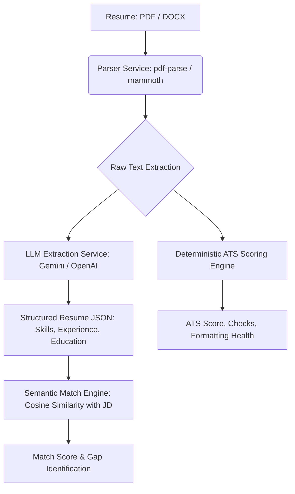
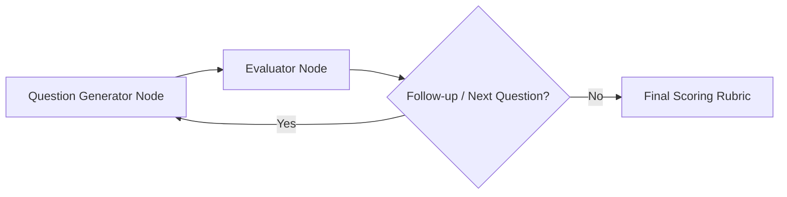

# AI Career Twin — Product Roadmap & Architecture

This document serves as the persistent product roadmap, technical design contract, and memory of the AI Career Twin product. Designed for a senior tech architecture context, it treats the project not as a simple toy/prototype, but as a production-grade SaaS product.

---

## 🛠️ Phase 1 — Resume + ATS Analyzer (Current Phase)
*Objective: Establish the document-parsing, deterministic rule-based analysis, and LLM structured extraction pipeline.*

### 1. Parsing & Extraction Pipeline

* **Resume Parser:** Handle DOCX (via `mammoth`) and PDF (via `pdf-parse`).
* **Structured Extraction:** Transform unstructured text into a clean JSON Schema (`skills`, `experience`, `education`) utilizing Gemini/OpenAI structured outputs.
* **Deterministic ATS Scoring:**
  * Strict rule-based checks (contact info, sections presence, quantified bullet points, word counts, formatting noise proxy).
  * Implemented in JavaScript for testability, consistency, and zero API call overhead.
* **Semantic Match Engine:** Calculate cosine similarity between the extracted resume skills/experience embeddings and the user-provided Job Description.

---

## 🎯 Phase 2 — Skill Gap + Roadmap Generator (Weeks 3-4)
*Objective: Build personalized skill roadmaps and gap-analysis engines using static datasets & LangGraph planners.*

* **Target Role Context:** Input target role and senior level.
* **Skill Ontology / RAG Retrieval:** Compare extracted resume skills vs. role requirements using a curated skills/roles dataset.
* **LangGraph Planner Agent:**
  * **State:** Remaining gaps, available hours/day, target completion date, current roadmap progress.
  * **Nodes:**
    * `Analyzer Node`: Identifies high-priority gaps.
    * `Planner Node`: Generates daily/weekly personalized study plans, recommended projects, or certifications.
    * `Reviewer Node`: Checks plan feasibility against available hours/day.

---

## 💻 Phase 3 — GitHub Analyzer (Weeks 5-6)
*Objective: Quantify development practices and engineering behaviors using heuristics and lightweight summaries.*

* **GitHub API Integration:** Fetch repository metadata, commit frequencies, programming languages, README presence, and test coverage indicators.
* **Heuristic Profiling:**
  * Code cleanliness, project structure, repository diversity.
  * Commit frequency & consistency (green-square density).
* **LLM Summarization:** Instead of executing expensive code reviews via LLM, use the LLM to generate high-level summaries of featured projects, identifying architecture patterns used.

---

## 🗣️ Phase 4 — Mock Interview Agent (Weeks 7-9)
*Objective: A multi-turn interactive conversational agent assessing technical, behavioral, and architectural skills.*

* **LangGraph Multi-Turn Architecture:**
  * `Question Generator Node`: Generates relevant questions based on target role, experience level, and resume.
  * `Evaluator Node`: Critiques candidate answers against an internal rubric.
  * `Follow-up / Pivot Node`: Determines whether to deep-dive on the current topic or move to the next domain.
* **Voice vs. Text Modality:** Support whisper transcription for voice-in and text-to-speech for voice-out to simulate realistic interviews.

---

## 📊 Phase 5 — LinkedIn Check & Unified Dashboard (Weeks 10+)
*Objective: Profile assessment and synthesis of all data streams into a single "Readiness Dashboard".*

* **LinkedIn Profile Integration:** Since official APIs are highly restricted, provide clean workflows for copy-pasting profile text or importing PDF profile exports.
* **Unified Readiness Dashboard:**
  * Combined readiness score aggregating ATS score, skill match, GitHub activity, mock interview performance, and LinkedIn optimization.
  * Live action list highlighting the fastest path to hiring readiness.
